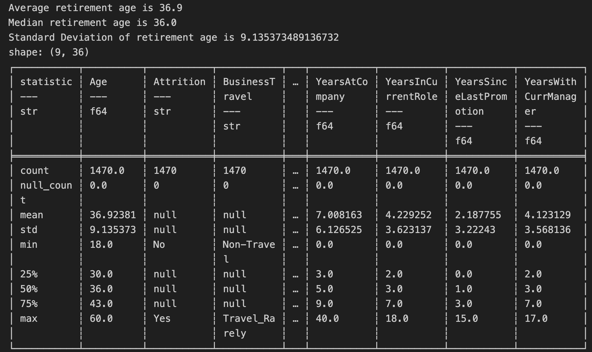

# IDS-706 Data Engineering Assignment
## Mini Project : Polars Descriptive Statistics Script

#### status(CI/CD) badge

### Requirements
    1. Python script using Polars for descriptive statistics
    2. Read a dataset (CSV or Excel)
    3. Generate summary statistics (mean, median, standard deviation)
    4. Create at least one data visualization

### Deliverables
    1. Python script 
    2. CI/CD with badge
    3. Generated summary report (PDF or markdown) via CI/CD for extra credit or making your own PDF or MD file and pushing it 

### Analysis
Dataset : [HR.csv](HR.csv) 
 - The data used in this analysis was provided by IBM and was originally created to study employee turnover.
 - From the available variables, I specifically focused on the "Age" at retirement.
 - Calcuated mean, median, standard Deviation and so on 

### Progress
#### Preperation
Created Github Repository and required files such as Makerfile, requirement.txt, CICD.yml and so on

[YAML](.github/workflows/CICD.yml) \
[Makerfile](Makerfile)\
[Requirements](requirements.txt)\
[testfile](test_main.py)

#### Analysis
Built a main.py and `main_test.py` in `main.py` this import CSV file(HR.csv) and calculate average, median, and Standard deviation of retired employees by ***`Polars`***. Additionally, plot a histrogram to visualize the age distrubution of the retired employees.

Refer to the details below for more information

### Extra Credit
#### Performance test

Please refer to the summarized report in the attached PDF : [Summary_Report_PDF](main_report.pdf)

Here are performance test results comparing Pandas and Polars : [Performance_test](performance_test.py)
* Pandas processing time: 0.0081 seconds
* Polars processing time: 0.0034 seconds
* Polars processing is **58.26%** faster than Pandas

